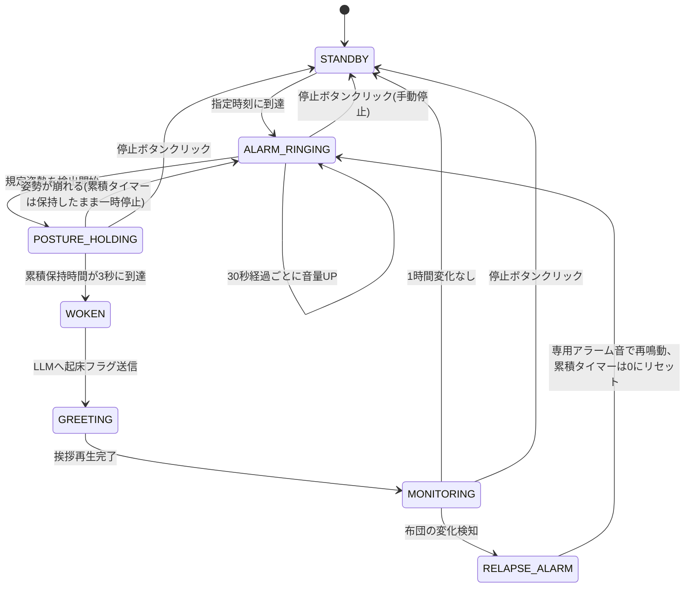

# マルチモーダル対話システムを利用した二度寝防止システム — 要件定義書

## 1. 背景

現在、朝の起床に悩みを抱えている。

スマートフォンのアラームでは、画面をタップするだけで停止できてしまい、無意識のうちにアラームを止めて再び眠ってしまう「二度寝」が頻発している。

また、既存の二度寝防止サービスでは音声や複数の操作の組み合わせによってユーザーが起床しているかを検知しており、カメラで検知しているものは少ない。

## 2. 解くべき課題

既存のシステムにおける最大の課題は、「アラームが止まること」と「ユーザーが実際に起床したこと」がイコールになっていない点である。

ユーザーがベッドから出て完全に立ち上がったことをシステム側で客観的に判断し、さらにその後「二度寝していないか」を一定時間監視し続ける仕組みが必要である。

## 3. 解決方法

本システムでは、PCのWebカメラ（視覚）、スピーカー（聴覚）、および大規模言語モデル（言語）を組み合わせたマルチモーダル対話システムを構築し、課題を解決する。

## 4. 目的・ゴール

身体的な起床動作と、その後の継続監視によってのみアラームが完全停止するシステムを構築する。

## 5. スコープ

| 含む | 含まない |
|---|---|
| ①姿勢認識による起床判定 | スマホ連携・外部通知 |
| ②LLMとの音声対話（起床確認〜挨拶） | 複数ユーザー対応・個人識別 |
| ③二度寝の常時監視（布団の高さ・幅変化） | クラウド常駐・24h稼働運用 |

## 6. 機能要件

### F1. 姿勢認識による起床判定（視覚）

- 入力: Webカメラ映像（リアルタイム）
- モデル: `yolov8n-pose.pt`（軽量・高速モデルを採用。速度優先でリアルタイム性を確保）
- 処理間隔: 約0.15秒間隔で判定（毎フレーム処理はせず間引く。累積タイマーの精度と処理負荷のバランスを考慮）
- 判定条件（以下をすべて満たす場合に姿勢OKとする）:
  1. **手首が頭（鼻）より明らかに高い位置にある**（左右どちらか、または両方の手首のy座標が鼻のy座標より一定以上小さい＝大まかな判定でOK）
  2. **肩と腰のキーポイントがほぼ垂直に並んでいる**（直立の判定）、かつ上半身（肩・腰）がフレーム内に収まっている
  3. 判定に使うキーポイント（肩・腰・手首・鼻）の**検出信頼度（confidence）がすべて閾値以上**
     - 布団や物陰から手だけ伸ばすなど不完全な映り方を、新たな専用ロジックを足さずに自然に排除するための条件
- カメラ設置条件: 就寝時・起床後の直立時ともに**上半身が映っていればよい**（全身を映す必要はない）
- 判定条件: 規定姿勢の**累積保持時間が合計3秒に到達**したら起床成立
  - 姿勢が途中で崩れても累積タイマーはリセットしない（一時停止し、再度姿勢が取れたら再開）
- 出力: 起床フラグ（bool）、アラーム停止イベント

### F2. LLMへの状況伝達と対話生成（言語・聴覚）

- 入力: F1の起床フラグ
- 処理: Gemini APIに状況（起床成立）を送信し、朝の挨拶テキストを生成
- 音声合成: VOICEVOX Core（ローカル・CUDA版）、`11kai/voicevox.py` の構成を流用
  - 話者: ずんだもん（ノーマル）、スタイルID `5`
  - 実行環境: Python 3.10（GPTSoVits仮想環境、CUDA 12.8）
  - 依存: `dict/`, `models/vvms/0.vvm`, `onnxruntime/` を本プロジェクトフォルダにもコピーする必要あり
- 出力: 生成テキストをVOICEVOXでTTS化し、スピーカーから再生（`sounddevice`等でストリーミング再生）

### F3. 二度寝の常時監視

- ROI設定: システム起動時に**手動でベッド領域を指定**（マウスドラッグ等でROI矩形を設定）
- キャリブレーション: 起床成立（WOKEN）後、**人物がフレームから消えたタイミング**でベッドの状態を基準フレームとして記録
  - 単眼RGBカメラでは奥行き情報がないため、「高さ・幅」は物理量ではなく面積ベースの近似指標として扱う
- 検出方法: 基準フレームと現在フレームでROI内を**背景差分**（グレースケール化→差分→二値化）し、**変化ピクセルの割合（%）**を「布団の膨らみ指標」とする
- 閾値: ROI内の**15〜20%以上のピクセルが変化**したら「二度寝の兆候あり」と暫定判定（実測して調整）
- 誤検知対策: 変化が**10秒間継続**した場合のみ「二度寝の兆候あり」と確定判定（一瞬の寝返り・照明変化等による誤検知を抑制）
- 監視頻度: **1秒間隔**でチェック（起床判定ほどの即応性は不要なため負荷軽減）
- 判定: 変化検知（10秒継続） → アラーム再鳴動 / 1時間変化なし → カメラOFF・待機状態へ

### F4. 異常系ハンドリング

| 異常 | 検知方法 | 対応 |
|---|---|---|
| カメラ取得不可/切断 | `cv2.VideoCapture.read()`が失敗、またはフレームが一定時間更新されない | 警告音（短いビープ）を鳴らして異常を通知。ログにも記録 |
| Gemini APIタイムアウト/エラー | APIコールの例外/タイムアウト検知 | あらかじめ用意した定型文（例:「おはようございます」）にフォールバックしてVOICEVOXで読み上げ |
| 手動停止 | 画面上の「停止」ボタンのクリック | 全状態から`STANDBY`へ強制遷移、カメラOFF・音声停止 |

### GUI要件

- Webカメラ映像を表示するウィンドウ（OpenCVの`imshow`ベース）
- 映像上に「停止」ボタンを描画し、`cv2.setMouseCallback`でクリック領域を判定 → クリックで強制停止
- 現在の状態（STANDBY/ALARM_RINGING/MONITORING等）や累積保持時間を画面上にテキスト表示

## 7. 状態遷移



### 状態一覧

| 状態 | カメラ | スピーカー | 説明 | 滞在時間の目安 |
|---|---|---|---|---|
| **STANDBY** | OFF | 無音 | 待機状態。指定時刻までスリープ | 〜指定時刻まで |
| **ALARM_RINGING** | ON | 大音量アラーム（30秒ごとに音量UP） | 姿勢検出待ち | 無制限 |
| **POSTURE_HOLDING** | ON | 大音量アラーム継続 | 規定姿勢を累積カウント中 | 累積3秒に達するまで |
| **WOKEN** | ON | 停止 | 起床確定。LLMへ状況送信中 | 数秒（API応答待ち） |
| **GREETING** | ON | ずんだもん音声再生 | LLM生成テキストの読み上げ中 | 数秒〜十数秒 |
| **MONITORING** | ON | 無音（検知時のみ反応） | 布団監視中 | 最大1時間 |
| **RELAPSE_ALARM** | ON | 専用アラーム音 | 二度寝検知、専用音でALARM_RINGINGへ | - |

## 8. 非機能要件

- 起床判定の処理はリアルタイム性が必要（遅延1秒未満を目標）
- 誤検知（姿勢を取っていないのにアラームが止まる）は許容度を低く設定
- LLM応答待ちの間、無音にならないよう簡単な効果音等でつなぐことを検討

## 9. 使用技術・環境

| 項目 | 内容 |
|---|---|
| 言語 | Python |
| 画像処理 | OpenCV, ultralytics（YOLO pose） |
| 音声合成 | VOICEVOX Core（ローカル, CUDA）— ずんだもん style_id=5、`11kai/voicevox.py` ベース |
| 音声再生 | `sounddevice`（新規追加、wav再生用） |
| LLM | Gemini API（**要APIキー取得**） |
| 実行環境 | 自分のPC + 内蔵/外付けWebカメラ、Python 3.10（GPTSoVits仮想環境 or 同等の新環境） |

## 9-1. フォルダ構成・開発環境詳細

### 実行環境の方針
- YOLO・Gemini・VOICEVOXをすべて**GPTSoVits仮想環境（Python 3.10, CUDA 12.8）に一本化**して動作させる
- `11kai/`から`dict/`, `models/vvms/0.vvm`, `onnxruntime/`を本プロジェクトフォルダへコピーして使用する
- 追加インストールが必要なパッケージ: `ultralytics`, `google-generativeai`, `sounddevice`, `opencv-python`（未導入分のみ）

### フォルダ構成

```
nidone_boushi_system/
├── REQUIREMENTS.md          # 本要件定義書
├── README.md                # 使い方（後日、要件定義から転用）
├── main.py                  # エントリーポイント・状態遷移（ステートマシン）管理
├── config.py                # 各種閾値・パラメータ（F1/F3の閾値、時刻設定等）をまとめる
├── modules/
│   ├── posture.py           # F1: YOLO pose姿勢判定
│   ├── futon_monitor.py     # F3: 背景差分による布団監視
│   ├── llm_client.py        # F2: Gemini API呼び出し・フォールバック処理
│   ├── voice.py             # F2: VOICEVOX音声合成・再生（11kai/voicevox.pyベース）
│   └── ui.py                # GUI: 映像表示・停止ボタン
├── assets/
│   └── sounds/
│       ├── alarm_normal.wav      # 通常アラーム
│       ├── alarm_relapse.wav     # 二度寝専用アラーム
│       └── camera_error_beep.wav # カメラ異常通知音
├── models/
│   ├── yolov8n-pose.pt       # 姿勢推定モデル
│   └── vvms/0.vvm            # VOICEVOXずんだもんモデル（11kaiからコピー）
├── dict/                     # OpenJTalk辞書（11kaiからコピー）
├── onnxruntime/              # VOICEVOX Core依存（11kaiからコピー）
└── requirements.txt          # GPTSoVits環境に追加するパッケージ一覧
```

## 10. 制約・前提条件

- 単一ユーザー・単一部屋・固定カメラ位置を前提とする
- 早朝の暗所での検出精度低下はリスクとして明記し、必要なら照明条件を限定する
- Gemini APIの無料枠のレート制限・レイテンシに依存する

## 11. 評価方法（デモ想定）

- シナリオ1: 起床動作を正しく行い、アラーム停止→挨拶→監視→カメラOFFまでの一連の流れを実演
- シナリオ2: 起床動作をせず放置→アラームが鳴り続け、30秒ごとに音量が上がることを確認
- シナリオ3: 起床後に再度横になる→専用の音でアラーム再鳴動を確認
- シナリオ4: カメラを外す/Gemini APIを止めるなど異常系を発生させ、フォールバック動作を確認

## 12. 未決事項（今後詰める）

- F1: 手首/鼻のy座標差の具体的な閾値、confidenceの具体的な閾値（実測して調整）
- F3: 変化ピクセル割合の閾値（15〜20%は暫定値、実測して調整）
